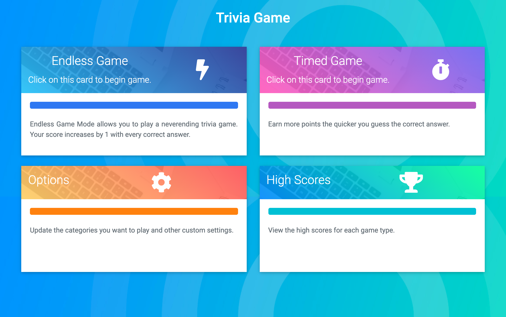
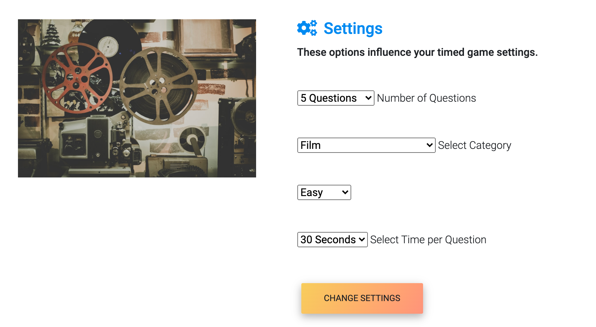
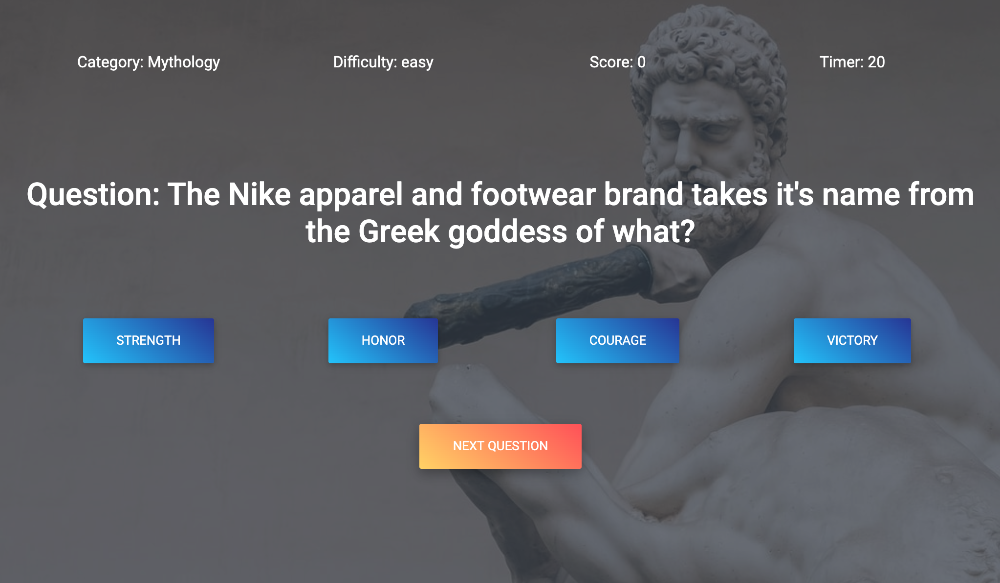
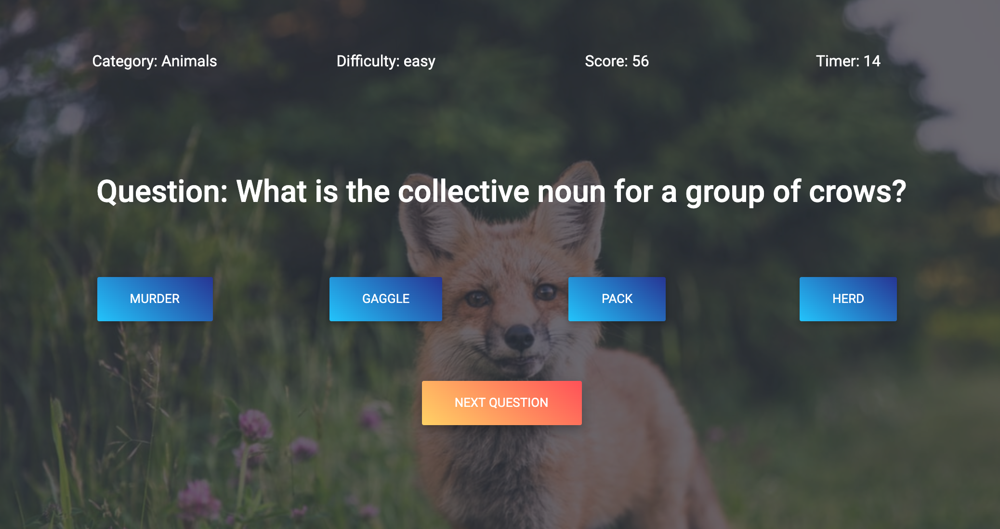

# Project One: Trivia Game

This project uses our team's skills in DOM manipulation, using APIs with AJAX requests, using APIs with fetch functions, and much more. 

## URLs
Github - https://github.com/marcos-cmd/Project1-Trivia-App
Github Pages - https://marcos-cmd.github.io/Project1-Trivia-App/

## User Story

As someone with immense useless knowledge, I want to be able to test that knowledge. Then show off my known knowledge in the form of a score. 

If I am a student, maybe I want to test knowledge of a certain category. 

## Group Members
- Marcos Garcia
- Augustino Przygocki
- Clarence Guerrero

## Layout

## Change settings in the Options Menu

## Test your knowledge

## Save your high score

## Nice To Haves or Stretch Goals
1. P vs C, P vs P
2. Player vs Computer with different degrees of difficulty (Easy, Medium, Hard)
3. Enable lifelines/hints/clues option
4. Different ways to present a question (ex. Puzzle, where’s waldo-type, anagram, logo/picture game)
5. Enable Adding (and saving) new questions or Categories
6. For P vs P, designAssigning keypress functions to quickly answer questions
7. Player v Player hotkey buzz-in 

## MVP Requirements
Must use at least two APIs
Must use AJAX to pull data 
Must utilize at least one new library or technology that we haven’t discussed
Must have a polished frontend / UI
Must meet good quality coding standards (indentation, scoping, naming)
Must NOT use alerts, confirms, or prompts (look into modals!)
Must have some sort of repeating element (table, columns, etc)
Must not use Bootstrap. Use an Alternative CSS Framework
Must be Deployed (GitHub Pages or Firebase)
Must have User Input Validation
